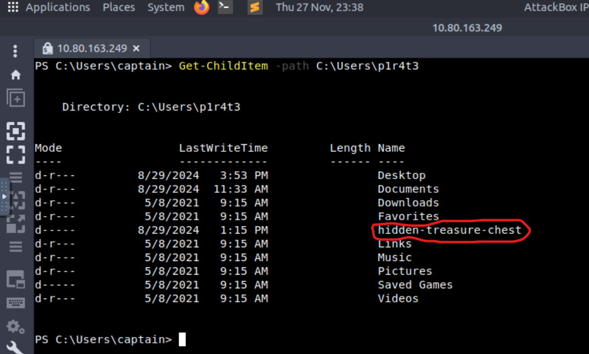
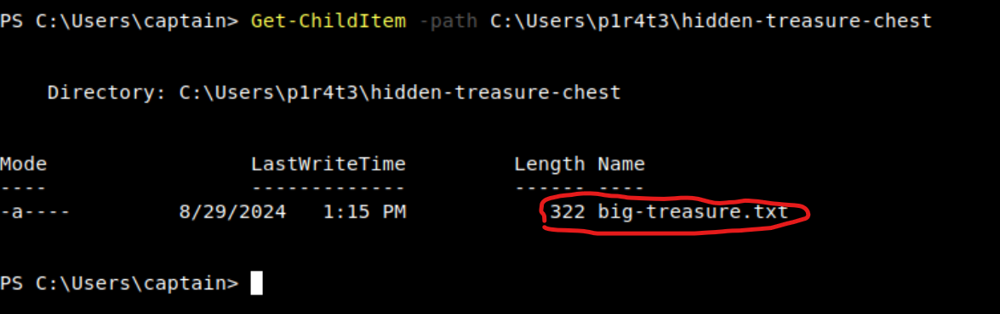
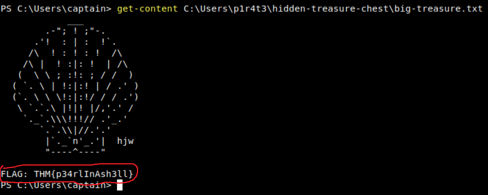
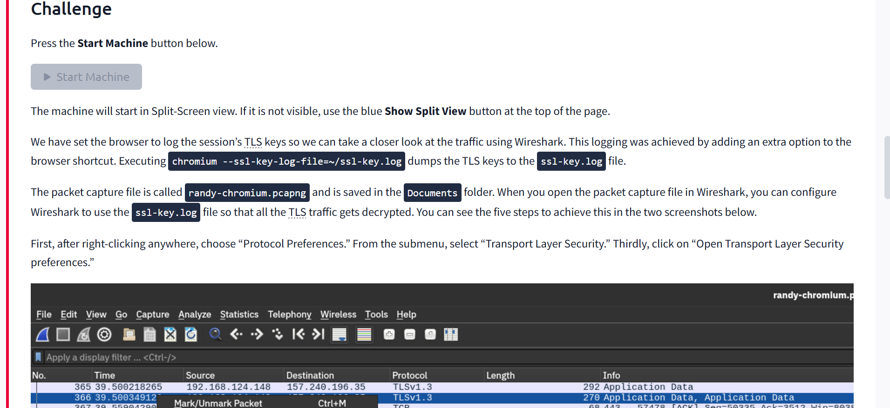
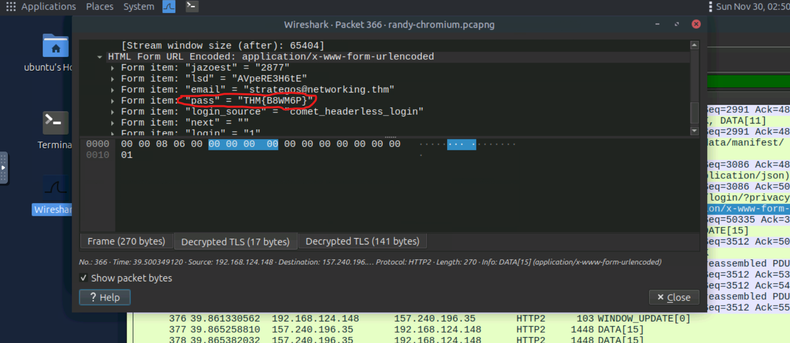

# TryHackMe Cyber security 101 Course

# סיכום Active Directory Basics

## מה למדתי

- מבנה של AD הכולל בתוכו את בסיס הנתונים ו DC (Domain Controller)
- סוגי ישויות כגון משתמשים, מכונות, סוגי קבוצות ועוד
- רקע כללי על OUs (Organizational Units)
- יצירה ומחיקה של OUs על ידי הגדרות מתקדמות
- שימוש ב-Delegation
- Group Policy Objects (GPO)
- הגדרה של פעולות שונות על משתמשים כמו ביטול גישה לפאנל השליטה

## Windows Command Line

- מה זה ipconfig ומה מטרתו ושימוש בפקודה
- מה זה Ping ושימוש בפקודה
- פקודת tracert
- פקודת nslookup
- פקודת netstat
- פקודות cd וdir
- פקודות בסיסיות type, copy, move, erase/del
- שימוש במנהל המשימות עם פקודת tasklist
- פקודות בסיס בpowershell כמו: get-childitem, set-location, new-item, remove-item
- שימוש באופרטורים כמו -eq, -ge, -gt, -le

- תרגול מציאת דגל כחלק מהמודל מצורפים צילומי מסך
  
  
  

- היכרות עם עוד פקודות כמו Get-Process, Get-Service ועוד הקשורות לנתוני מערכת מתקדמים

## Networking

- OSI Model 7 השכבות
- TCP/IP model
- Subnet
- UDP ו- TCP
- שימוש בפקודה telnet
- Dhcp
- Arp protocol
- ICMP
- Routing
- NAT
- DNS protocol
- שימוש בפקודת whois
- HTTPS protocol
- ftp protocol
- POP3 ו-IMAP
- SMTP/S protocol
- TLS protocol
- SSH protocol והשימוש בו
- הסבר על SFTP ו-FTPS
- VPN רקע כללי ושימוש

- תרגול פענוח תעבורת TLS מוצפנת באמצעות Wireshark
  
  

## WireShark basics

- מבנה התוכנה
- צביעת פקטות
- סינון פקטות בתצורות שונות
- מבנה של כל פקטה וממה היא בנויה
- ניווט בין פקטות
- ייצוא מידע/קובץ מתוך פקטות

## Tcpdump basics

- שימוש בפגקודת TCPDUMP
- שימוש בדגלים שונים בפקודה
- הוספת פילטרים שונים
- תצוגת פקטות על ידי הפקודה

## Nmap Basics

- שימוש בפקודה לצורך גילוי מכשירים זמינים ברשת (Live hosts)
- שימוש לסריקת פורטים
- שימוש בדגלים שונים בפקודה
- גילוי גרסאות ומערכות הפעלה של מכשירים ברשת
- שמירת סריקה לקובץ

## Cryptography Basics

- חשיבות הצפנה
- הבדל בין טקסט רגיל למוצפן
- סוגי הצפנות כמו סימטרית ואסימטרית
- רקע כללי על הצפנת RSA
- שימוש בSSH

## תובנות אישיות

- איך בנוי AD
- סוגי ישויות שונות שנכללות בכל התחום הזה
- מה זה OUs ומה מטרתם
- איך להשתמש בהאצלת סמכויות בתוכנה (Delegation)
- מה זה GPO איך להגדיר אותו ואיך ליישם אותו על מחלקות שלמות/משתמשים
- איך לנהל באופן כללי חברה קטנה תחת AD הגדרת חוקים והחלתן על המכונות/משתמשים
